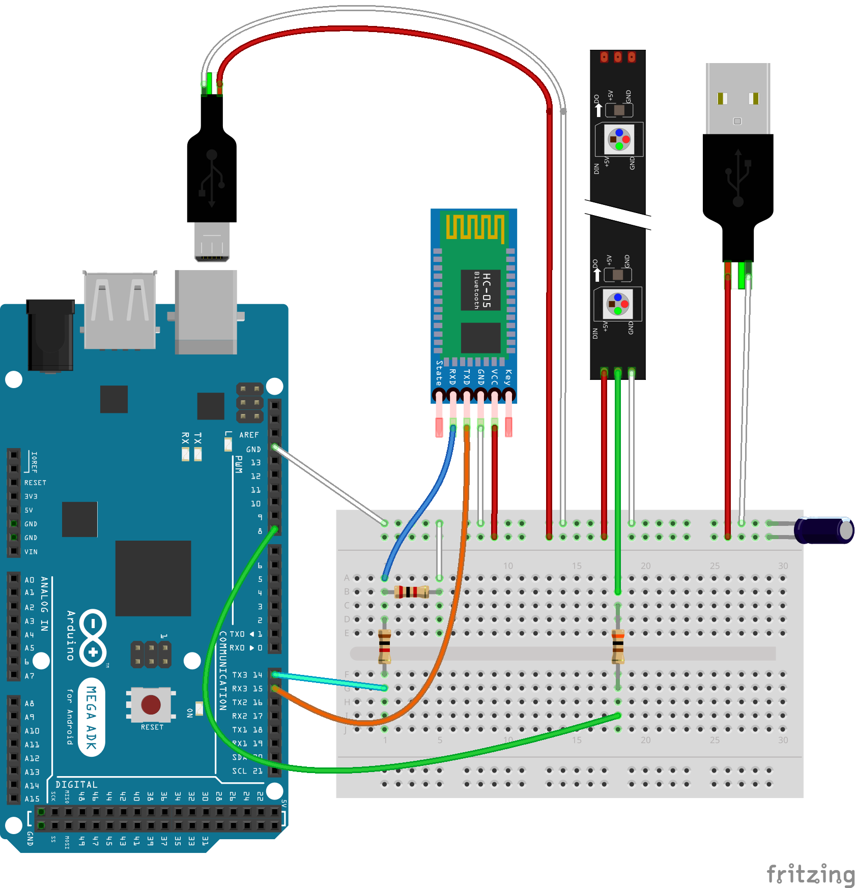
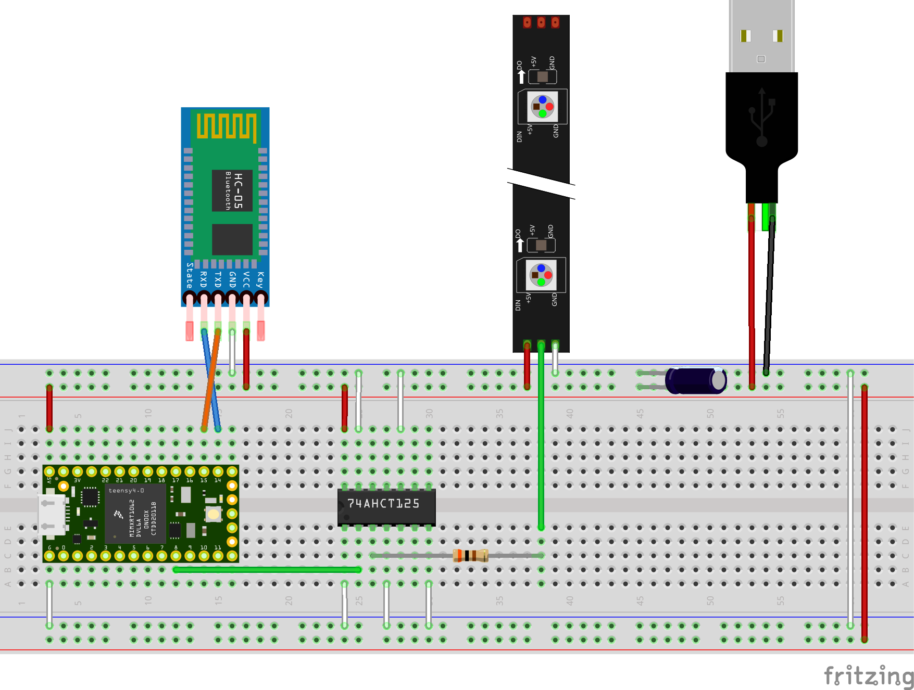

# Another Light Painting Stick (ALPS)

This is just another programmable light painting stick.

But, compared to the other projects I've seen so far, instead of
storing all the settings on an SD card you can program the stick from
the phone.

WARNING: this is a work in progress and documentation may be not
         aligned with the current status of the code.

## TODO

An unordered list of stuff I'd like to work on:

- documentation:
  - add some example photos;
- on the board side:
  - re-add/improve SD card support;
- on the Android side:
  - re-design the whole app UI/UX (any help is appreciated);
  - add gradient/pattern generators;
  - write some unit test;

And most important:
- take many photos, enjoy the time spent, and find new features to implement :)

## Hardware

The following links are **not** affiliated. What follows is just a
list of stuff I bought and paid out of my pocket (well, technically
the Arduino was a birthday present from friends, but you know what I
mean).

For sure there are alternative products I'm not aware. If you know any
that may work better, please let me know.

- USB power bank;
- [Adafruit NeoPixel](https://learn.adafruit.com/adafruit-neopixel-uberguide/)
  144 LEDs 1 meter strip;
- HC-05 or HC-06 Bluetooth module;
- a capacitor between 500 and 1000 µF at 6.3 Volts or higher[^1];
- a resistor between 300 to 500 Ohm[^1];
- some USB cable to salvage;
- (Arduino Mega ADK)[https://docs.arduino.cc/retired/boards/arduino-mega-adk-rev3]
  or equivalent;
  - 1K resistor;
  - 2K resistor;
- or (Teensy 4.0)[https://www.pjrc.com/store/teensy40.html] which is
  more expensive than Arduino but faster.
  - [74AHCT125 quad level shifter](https://www.adafruit.com/product/1787)

I power everything using a 10400mAh USB power bank. There are a couple
of issues to keep in mind when using USB power banks for this project:

1. some power banks may disconnect the power if they see that there is
   too little usage (in other words, when the LED strip is off);
2. USB power banks usually limits the current at 2A (following the USB
   standard). At full brightness white, 144 NeoPixels consumes more
   than 8A[^1]. In practice that's probably too much light if you want
   to light paint.

More experiments using lithium batteries are needed, the power bank
has the benefit of simplicity because it doesn't require any voltage
regulator.

On the board side, not a lot of connectors are required. I suspect
that pretty much any programmable microcontroller could work as long
as you can load Arduino code on it.

My only suggestion is to be sure that it has at least a second
hardware serial to connect the bluetooth module.
It is not strictly required, but having the USB serial free is useful
to write debug messages, and I noticed that the software serial
library is usually not reliable enough for this project.

About the bluetooth module, the HC-05 may be faster (but if you can
find a good datasheet to prove it please let me know). But since we
don't need master mode the HC-06 can be good enough.

About the NeoPixels, I use the 144 LED for 1 meter. It is possible to
get less dense strips, but the result is much more pixelated.
Some code change is required if you want to support more than 144 LEDs.

The connections are pretty easy, but there are serious differences
between using Arduino or Teensy because Arduino is a 5V board while
Teensy is a 3v board.

WARNING: In both the cases the LED strip **cannot** be powered from
         the board because it drains far too much current.  If you
         power the board from a different source (for example the
         computer, when you connect it to load new code), it is
         important to share the ground. Also, don't put current on the
         NeoPixel data pin unless the NeoPixel is powered too[^1].
         In doubt, always disconnect the extra power and the whole LED
         strip while connecting the board to the computer.

The capacitor is used to smooth current peaks, according to the
NeoPixel guide[^1] it is mostly required if you power it from a bench
transformer, but it doesn't hurt to keep it there in any case to give
the extra power in case of brief spikes.

The resistor on the NeoPixel data pin should protect the 1st
pixel[^1]. It should be as close as the LED as possible.

TX and RX pin between the bluetooth module and the board are crossed
because the transmission of one goes to the receiving pin of the
other.

### Arduino

Arduino can be powered with 5V only from the USB cable, here it is
good if you have an old cable around to cut.

Remember that the bluetooth module data pin is 3.3V only. Therefore
you need the 2 resistors to lower down the 5V arduino output. The 1K
resistor between the arduino TX pin and the bluetooth RX pin, and the
2K resistor between the bluetooth RX pin and the ground.

The cable between the ground pin and the ground power is not required
in this configuration because the ground is already connected through
the USB cable.
But it is required if you power the board from the computer while the
LED strip is powered from the battery. Since this extra connection
doesn't hurt in any case, I strongly suggest to keep it always in
place.

### Teensy 4.0

Being a 3V board, the Teensy can be powered from 5V through the 5V
pin.

WARNING: remember to remove the cable to the 5v pin if you connect the
         Teensy via USB to the computer while the LED are
         powered. Otherwise you may damage your computer.

The 74AHCT125 is used to send 5V signals to the NeoPixel data pin from
the 3V output. It is not always required, according to many websites
newer LED strips works with a 3V input too. But I noticed some
glitches without it, especially using the FastLED library.

Most of the connections around the 74AHCT125 are required only because
"all unused inputs of the device must be held at VCC or GND to ensure
proper device operation"[^2].

[^1]: https://learn.adafruit.com/adafruit-neopixel-uberguide/powering-neopixels
[^2]: https://www.ti.com/lit/ds/symlink/sn74ahct125.pdf

## License

This program is free software. The code I wrote is under GPL but some
of it depends on libraries under different (but compatible) license.
In doubt check the header of the specific files.
